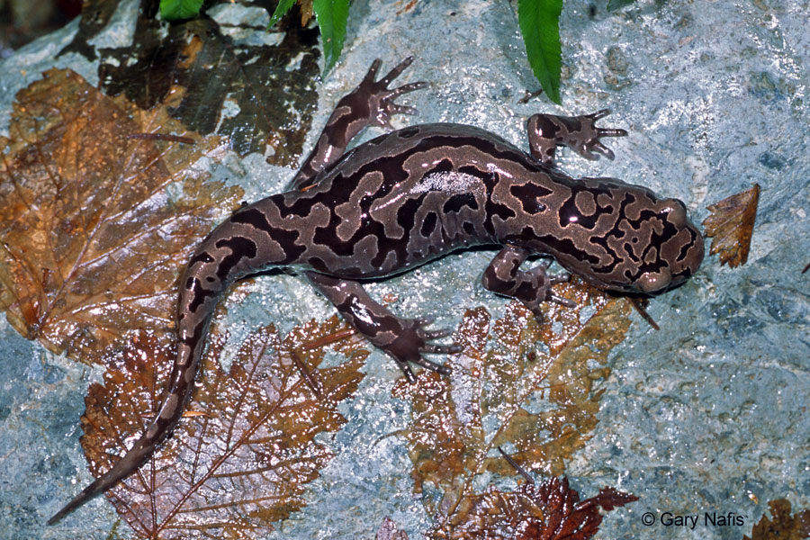

```{r setup, include=FALSE}
knitr::opts_chunk$set(echo = TRUE, warning = FALSE, message = FALSE, include = FALSE)
```


```{r}
# First, loading in necessary packages
library(tidyverse)
library(janitor)
library(kableExtra)
 # devtools::install_github("dill/beyonce")
library(beyonce)
# install.packages("cowplot")
library(cowplot)
library(car)
library(here)
library(forcats)
```


### *Introduction* 
 
Much of forests in Oregon were cut down for lumber and grazeland during the second half of the 20th century (Bolsinger & Wattle, 1993.) Such changes in habitat can play a major role in the health of the Pacific Giant Salamander (Dicamptodon tenebrosus), our species of study. Salamander abundance and health has been measured from 1993-2017 within Mack Creek (Gregory, 2016.) This study intends to analyze how salamanders differ across years and habitat variations within the creek. As the largest amphibian in North America, the salamander species gives us an indicator species to environmental conditions impact the wildlife within Willamette National Forest, where forest conditions have returned, after millions of acres were cut down (Bolsinger & Wattle, 1993.) 





```{r}
# Reading in dataframe
mack_creek_raw <- read_csv("mack_creek_vertebrates.csv")
```

```{r}
# Looking at salamander-specific data (species code DITE)
salamander_data_total <- mack_creek_raw %>% 
  clean_names() %>% 
  filter(species == "DITE")

salamander_by_year <- salamander_data_total %>% 
  group_by(section) %>% 
  count(year)
```


```{r}
### Let's look at some explaoratory data to see spread, potentially normal distribution. 

ggplot(data = salamander_by_year, aes(x = n)) +
  geom_histogram()

ggplot(data = salamander_by_year, aes(sample = n)) +
  geom_qq() 

## This qq plot is looking pretty dang normally distributed, the histogram has some gaps, potentially multiple modes! 
```


### *Methods*
The data utilized for this analysis was collected annually throughout both Clear Cut and Old Growth sections of Mack Creek. The same 150m were sampled throughout the 24 year period, and Pacific Giant Salamander abundance, length and weight were recorded. Utilizing this data we conducted analyses to better understand differences in salamander size and abundance in relation to habitat variations throughout the creek. We performed exploratory data visualization, chi squared analysis, a two sample t-test, one-way ANOVA and post-hoc Tukey test. A significance level of *a*=0.05 was used as a cutoff. All analyses were performed using R 3. 6. 1. 


#### *Results A:* 

Annual salamander abundance is displayed from 1993-2017, highlighting the comparison of sections of the creek in clear cut and old growth portions of forest (Figure 1). While there is slight variability, there is no clear difference in salamander abundance between clear cut and old growth forest. In general, abundance appears to have increased during the time period of study. 


```{r}

salamander_count <- salamander_data_total %>% 
  select(year, section, sampledate, species) %>% 
  group_by(year) %>% 
  count(section)

#change OG and CC to Clear Cut and Old Growth

salamander_count$section <- gsub("CC", "Clear Cut", salamander_count$section)

salamander_count$section <- gsub("OG", "Old Growth", salamander_count$section)

#Graph annual abundance (bar graph? kinda gross but can change later)
annual_abundance <- ggplot(salamander_count, 
       aes(x = year, y = n)) +
  geom_bar(position = "dodge",
           stat = "identity", 
           aes(fill = section)) +
  labs(x = "Year", 
       y = "Salamander Count", 
       title = "Mack Creek Annual Salamander Abundance",
       caption = "Figure 1: Salamander abundace was measured from 1993-2017, with individual counts for Clear Cut and Old Growth Forests each year, delineated by color.") +
  theme_bw() +
  theme(legend.position= "bottom",
    legend.title = element_blank(), 
    legend.direction = "horizontal") +
  scale_x_continuous(expand = c(0,0), 
                     limits = c(1993, 2018),
                     breaks = c(1990,2000, 2005, 2010, 2015)) +
  scale_y_continuous(expand = c(0,0),
                      breaks = c(100, 200, 300),
                     limits = c(0, 450)) +
  scale_fill_manual(values = beyonce_palette(5))

annual_abundance
```


```{r include=TRUE, echo = FALSE, warning = FALSE, message = FALSE}

annual_abundance
```


```{r}
# Create data frame with salamander counts by channel classification and section
channel_counts <- salamander_data_total %>% 
  select(year, section, unittype) %>% 
  filter(year == 2017) %>% 
  filter(unittype %in% c("C", "P", "SC")) %>% 
  count(section, unittype) %>% 
  pivot_wider(names_from = unittype, values_from = n) %>% 
  rename("Section" = section, 
         #"Clear Cut" = CC, 
         #"Old Growth" = OG, 
         "Cascades" = C, 
         "Pool" = P, 
         "Side-channel" = SC)

# Rename CC and OG 
channel_counts$Section <- gsub("CC", "Clear Cut", channel_counts$Section)

channel_counts$Section <- gsub("OG", "Old Growth", channel_counts$Section)

#Make percentages table 
channel_proportions <- channel_counts %>% 
  adorn_percentages((denominator = "row")) %>% 
  adorn_pct_formatting(digits = 0) %>% 
  adorn_ns(position = "front") # this is the part that gives you the count and the percentages in the table 
  
# Final Table 

channel_proportions_table <- channel_proportions %>% 
  kable(col.names = c("Creek Section",
                      "Cascades",
                      "Pool", 
                      "Side-channel"
                      )) %>% 
  add_header_above(c("2017 Salamander Counts by Channel Classification in Old Growth and Clear Cut Sections of Mack Creek" = 4)) %>% 
  kable_styling(bootstrap_options = c("hover",
                                      "condensed", 
                                      "responsive"), 
                fixed_thead = T)

channel_proportions_table
```


```{r}
channel_chi <- channel_counts %>% 
  select(-Section)

channel_prop_chi <- chisq.test(channel_chi)

channel_prop_chi #not significant, retain null that Section and Unit Type are independent 

```

#### *Results B & C:* 

We evaluated the relationship between channel classification (Cascades, Pool and Side-Channel) and salamander abundance in both Old Growth and Clear Cut forest sections. While there are not clear trends between forest sections, the largest proportion of salamanders were found in Cascades, with Side-Channel and Pool creek sections following respectively. We conducted a chi squared analysis to determine if this relationship was statistically significant, and we did not find sufficient evidence to reject the null hypothesis that forest condition and channel classification are independent
($\chi$^2^(`r channel_prop_chi$parameter`) = `r round(channel_prop_chi$statistic,2)`, *p* = `r round(channel_prop_chi$p.value, 2)`).


**Table 1.** *Measuring 2017 salamander abundance relative to forest section, channel classification. Proportional abundance for Clear Cut and Old Growth forests are shown in parentheses to delineate channel. Chi-squared analysis detmerined this relationship to be statistically insignificant* *p* = `r round(channel_prop_chi$p.value, 2)`)
```{r include=TRUE, echo = FALSE, warning = FALSE, message = FALSE}
channel_proportions_table
```


#### *Results D:* 

By analyzing the weights of Giant Pacific Salamanders in Old Growth and Clear Cut sections of Mack Creek we calculated mean salamander weights of 7.8 grams in Clear Cut areas, and 6.6 grams in Old Growth areas. The P-Value of 0.09 led us to conclude that the two means are not significantly different from one another. However, Salamanders measured in clear cut forests are 18% heavier, on average, than their old growth counterparts. This remains  a notable change, even as it does not meet statistical significance.  


```{r}
#Starting with df to look at weigths of Giant Salamanders
salamander_weight_data <- salamander_data_total %>% 
  select(year, weight, section) %>% 
  filter(year == 2017)

# view(salamander_weight_data) 
  
### Creating a summary table to compare means of Clear Cut, Old Growth Forest. Creating summary table with acutal means, SD, as well as a T test table.  

weight_summary <- salamander_weight_data %>% 
  group_by(section) %>% 
  summarize(mean_weight = mean(weight, na.rm = TRUE,
            sd_weight = sd(weight, na.rm = TRUE)))
  
cc_weight <- salamander_weight_data %>% 
  filter(section == "CC") %>% 
  pull(weight)

og_weight <- salamander_weight_data %>% 
  filter(section == "OG") %>% 
  pull(weight)

t.test(cc_weight, og_weight)

```


#### *Results E:*
 

```{r}

### Creating df looking at creek areas for 2017, disregading the section now. 

channel_breakdown <- salamander_data_total %>% 
  select(year, unittype, weight) %>% 
  filter(year == 2017) %>% 
  filter(unittype %in% c("C", "P", "SC")) %>%   
  group_by(unittype) 

anova_channel <- channel_breakdown %>% 
  select(unittype,weight)

leveneTest(weight ~ unittype, data = anova_channel)

aov_salamander <- aov(weight ~ unittype, data = anova_channel)

aov_salamander
aov_outputs <- unlist(summary(aov_salamander))

aov_outputs

summary(aov_salamander)

TukeyHSD(aov_salamander)
```
Salamanders weights vary across different channels of Mack Creek, and this was found to be significant (*p* = `r round(aov_outputs[9],2)`). Of the three channels, salamanders in Side-Channels and Pools differed the most, with Salamanders in Side-Channels tending to be 3.62 grams heavier on average than those found in Pools. This provides a significant difference in mean weight (p-value = 0.02). While other channel-based means vary, the mean differences in weight remain minimal. Salamanders within Side Channels weigh the most, those in Cascades average in the middle of the three, and salamanders within Pools weigh the least, on average. (*p* = `r round(aov_outputs[9],2)`).


All three of these channels have notable outliers in which  heavy salamanders could skew the means.The median weight of salamanders across channels may be a more representative measurement of sampled areas.


```{r}
channel_graph <- ggplot(data = channel_breakdown, aes(x = unittype, y = weight, )) +
  geom_violin(aes(fill = unittype), show.legend = FALSE) +
 geom_boxplot(size = .5,
               width = .2) +
  stat_boxplot(geom ='errorbar', 
               width = .2) + 
  scale_x_discrete(labels = c("Cascade", "Pool", "Side Channel")) +
  scale_fill_manual(values = beyonce_palette(18)) +
  labs(x = "River Channel",
       y = "Weight in Grams", 
       title = "Salamander Weight Distribution Through \n Channels of Mack Creek") +
  coord_flip() +
  theme_bw()
channel_graph

```


```{r include=TRUE, echo = FALSE, warning = FALSE, message = FALSE}
channel_graph
```


### *Summary*


- There is no clear difference between salamander abundance between forest sections. 
- Salamander abundance appears to be highly correlated with the different channels of the creek. While it doesn’t meet the significance level of a=0.05, the measured difference shows some correlation. 
- Salamander weights change very little across channels. The only noticeable difference comes from side-channel salamanders, which, on average, weigh 3.62 grams more than salamanders within Pools. 


### *Citations:* 
Bolsinger, Charles L., and Karen L. Waddell. “Area of Old-Growth Forests in California, Oregon, and Washington.” *United States Department of Agriculture*, 1993, doi:10.2737/pnw-rb-197.

Gregory S. V. 2016. Aquatic Vertebrate Population Study in Mack Creek, Andrews Experimental Forest, 1987 to present. *Environmental Data Initiative.* https://doi.org/10.6073/pasta/5de64af9c11579266ef20da2ff32f702. Dataset accessed 11/19/2019

Mosquera, Giovanny M., Segura, Catalina, and Patricio Crespo. “Flow Partitioning Using High-Resolution Isotopic and Electrical Conductivity Data.” *Water.* 2018, https://doi.org/10.3390/w10070904 


